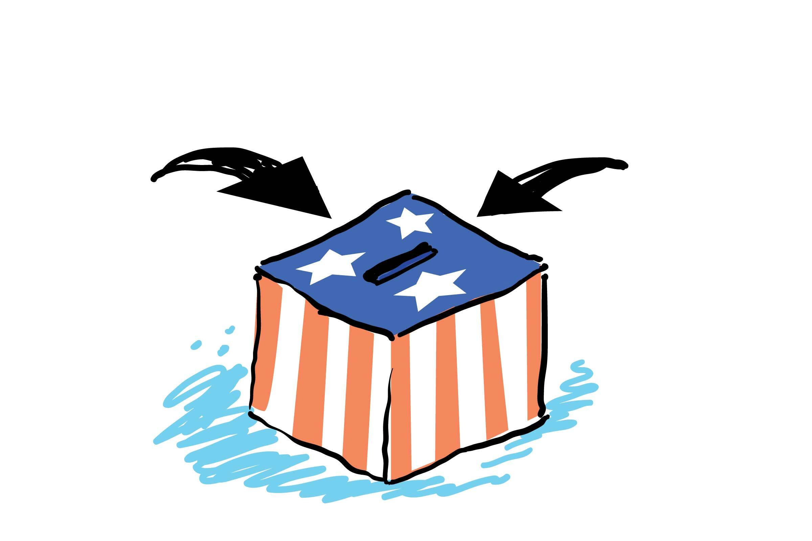

# Applied Data Science @ Columbia
## Fall 2020
## Project 1: A "data story" on how Americans vote



### [Project Description](doc/)
This is the first and only *individual* (as opposed to *team*) this semester. 

Term: Fall 2020

+ Project title: Why we should use statistical methods instead of traditional polling method in analyzing the American National Election Studies (ANES) data
+ This project is conducted by Tianle Zhu

+ Project summary: In this project, we do data cleaning and preprocessing on the American National Election Studies (ANES) data. Then we compare the traditional polling method with statistical methods, from the perspective of univariate analysis and multivariate analysis. We conclude that in univariate analysis, we cannot derive much insight from the visualizations. Meanwhile, in the multivariate analysis, there are also several limitations, which we will explicit in the summary section. However, the statistical methods make more sense both in univariate analysis and multivariate analysis. By using the statistical method, the inference result could be far more reliable than the traditional polling method. 

+ Project Conclusion: 
In this Project, I applied several statistical methods and polling method to 1) explore the respondents' voting activity
2) answer the two questions previously asked in Section 2. 3) discuss the advantage and disadvantages of these two methods.

#### **How these variables influence the respondents' voting activity?**
 + Polling method
   + Before the analysis, we have to choose our variables manually. 
   + Univariable analysis in the polling method can give us the estimated key values at a glance. For instance, we can conclude the female have a higher probability to vote than males in the Gender bar plot. 
   + **From bar plot, we can get some conclusion about each variable response to the probability to vote**
 
 + Statistical methods
   + When we do the data preprocessing, we can use model selection to help users to choose our variables that will affect our target variable Turnout (vote `1` or not vote `0`)
   + In univariate analysis, we can use coefficients and p-values from the summary of our final model. The positive or negative coefficients indicate in which direction would the attribute affects the respondents' probability to vote. The magnitude of the coefficient evaluates the degree of impact of that variable and is comparable among different variables.
   + **Except the variables Year and money, all other variables will affect the respondents' voting activity.** 

#### **What are the characteristics of active voters in the election?**
 + Polling method
    + By analyzing multiple variables, the polling method cannot give us clear and reliable results about which variables will affect the respondents' voting activity. Since after grouping by all variables, we get around 65 percent of subgroups which will vote with a probability of 100 percent. That result is questionable as the subgroup data size is not sufficient to do any inference. It cannot help us find the subgroup that has a higher probability to vote. Moreover, as the number of conditional variables increases, the data would be subsetted into the extremely sparse combination, and some combinations may not even exist. For example, the subgroup most likely to vote obtained from the logistic regression model doesn't have any data points in our data, thus not reflected in the polling method. 
    + **2614 subgroups** will vote with probability 100 percent 
    + **699 subgroups** will vote with probability 0 percent 
 
 + Statistical methods
    + By analyzing multiple variables, Statistical methods make a better inference. For instance, instead of inferring based on a small sample size subgroup, the logistic model uses all variables to build the model. Thus, the logistic model can provide more accurate inference. it overcomes the limit where there are no such subgroups as it can make inference based on all variables comprehensively. From the model performance part, our model obtains 76 percent accuracy.
    + **The most active group**:  
      + Region: `North Central (IL, IN, IA, KS, MI, MN, MO, NE, ND` 
      + Income:`68 to 95 percentile`
   + Work: `Clerical and sales workers`
   + Education: `College or advanced degree (no cases 1948)`
   + Race: `Black non-Hispanic (1948-2012)`
   + Gender: `Female`
   + meeting: `meeting Yes`
   + activities: `Activities level 4`
   + care: `Care a good deal`
   + tv: `Yes, watched TV program(s) about the campaign`
   + money:`money Yes` 
  + **The least active group**: 
   + Region: `South (AL, AR, DE, D.C., FL, GA, KY, LA, MD, MS, NC` 
   + Income: `0 to 16 percentile`
   + Work: `Laborers, except farm`
   + Education: `High school (12 grades or fewer, include.non-college`
   + Race: `American Indian or Alaska Native non-Hispanic (1966-2012)`
   + Gender: `Male`
   + meeting: `meeting No`
   + activities: `Activities level 1`
   + care: `Don't care very much or DK, pro-con, depends`
   + tv: `No, didn't watch TV programs about the campaign`
   + money:`money No`

Following [suggestions](http://nicercode.github.io/blog/2013-04-05-projects/) by [RICH FITZJOHN](http://nicercode.github.io/about/#Team) (@richfitz). This folder is organized as follows.

```
proj/
├── dev/Stats-5243-Project-1.html /Stats-5243-Project-1.Rmd
├── data/ anes_timeseries_cdf.dta
├── doc/
├── figs/ finalmodel_Summary.png/ election-ballot-box.jpg
└── output/data_use.RData
```

Please see each subfolder for a README file.
