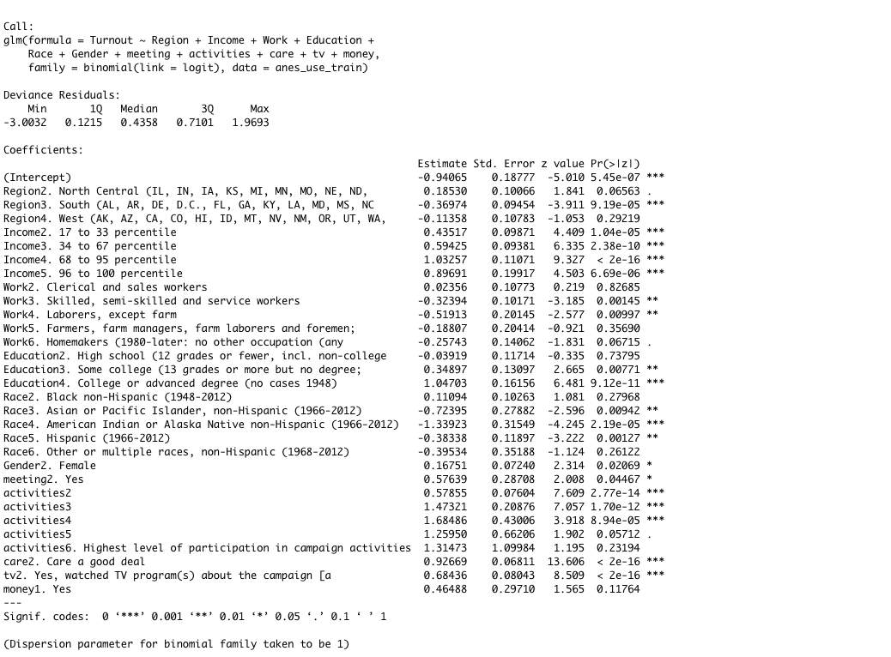

# Section 1: Introduction
From the 2016 election, we came to realize that the polling data can be significantly deviated from the ground truth. When various media industries are using poll data to make a statistical inference to predict that Hillary would win the election in 2016, rarely are they realize that the inference approach is limited. There are two reasons. First, the sample data may not be representative. As far as we know by the prospect the 2016 election, we realize that most of Trump's voters are not quite active in polling investigation, which biases the inference result, and leads to the unexpected winning of Trump. Secondly, the inference method is straightforward and naive. Without looking into how attributes can synergize together and affect the voting, the inference result would be unreliable. 

In this project, we do data cleaning and preprocessing. Then we compare the traditional polling method with statistical methods, from the perspective of univariate analysis and multivariate analysis. We conclude that in univariate analysis, we cannot derive much insight from the visualizations. Meanwhile, in the multivariate analysis, there are also several limitations, which we will explicit in the summary section. However, the statistical methods make more sense both in univariate analysis and multivariate analysis. By using the statistical method, the inference result could be far more reliable than the traditional polling method. 

From this report, we want to answer 2 questions:

+ **How these variables influence the respondents' voting activity?**
+ **What are the characteristics of active voters in the election?**

This report is organized as follows:
Section 2 load R packages and data and do data cleaning and pre-processing. Section 3 and 4 talk about the univariate and multivariate analysis, for the statistical method logistic regression model and polling method, respectively. Section 5 summarizes our observations and concludes the report. 


# Section 2: Data Pre-processing

## Step 2.1: Checking `R` packages for data processing

```{r load libraries, warning=FALSE, message=FALSE, include=FALSE}
packages.used = as.list(
  c(
  "tidyverse",
  "haven",
  "devtools",
  "RColorBrewer",
  "data.table",
  "ggplot2",
  "olsrr", 
  "haven",
  "car",
  "InformationValue",
  "ggpubr")
)

check.pkg = function(x){
  if(!require(x, character.only=T)) install.packages(x, character.only=T, dependence=T)
}
lapply(packages.used, check.pkg)
```

## Step 2.2: Import raw ANES data

```{r include = FALSE}
anes_dat <- read_dta("../data/anes_timeseries_cdf.dta")
```

## Step 2.3: Process variables for analysis
Original data and data missing value
Original data includes 1029 variables and 59944 observations
```{r echo = FALSE}
length(anes_dat)
nrow(anes_dat)
anes_orNAs=anes_dat %>% summarise_all(list(na.mean=function(x){mean(is.na(x))}))
anes_orNAs=data.frame(nas = unlist(t(anes_orNAs)))
ggplot(anes_orNAs, aes(x = nas)) + 
  geom_histogram(color="black", fill="grey", binwidth=0.05) +
  labs(title="The fractions of missing values in original data") +
  theme(plot.title = element_text(hjust = 0.5, size = 9)) +
  theme_light()
```

```{r echo = FALSE}
Election_years = as.character(seq(1952, 2016, 4))
anes_use = anes_dat %>%
  mutate(
    # demographic variables
    Year = as_factor(VCF0004), #0
    Turnout = as_factor(VCF0703), #14038
    Region = as_factor(VCF0112), #1801
    Income = as_factor(VCF0114), #5449 
    Work = as_factor(VCF0151), #19454
    Education = as_factor(VCF0110), #591
    Race = as_factor(VCF0105a), #1540
    Gender = as_factor(VCF0104), #144
    # active component variables 
    meeting = as_factor(VCF0718), # 9076
    activities = as_factor(VCF0723), # 12258
    care = as_factor(VCF0311), #26115
    tv = as_factor(VCF0724), # 22561
    money = as_factor(VCF0742) # 27245
    ) %>%
  filter(Year %in% Election_years) %>% 
  select(Year, Turnout, Region, Income, Work, Education, Race, Gender, meeting, activities, care, tv, money) 
anes_use$money <- relevel(anes_use$money, ref = "2. No")
anes_use$tv <- relevel(anes_use$tv, ref = "1. No, didn't watch TV programs about the campaign")
```

```{r echo = FALSE}
anes_NAs = anes_use %>% summarise_all(list(na.sum = function(x){sum(is.na(x))})) %>% as.matrix() %>% as.data.frame() %>% pivot_longer(everything(), names_to = "Variable", values_to ="Count") 
anes_NAs$Count = anes_NAs$Count/nrow(anes_use)

Plot_NA <- ggplot(data = anes_NAs, mapping = aes(y = Count, x = Variable)) + 
  geom_bar(stat = "identity", color = "black", fill="grey") + 
  labs(title = "The percentage missing values in the selected data") + 
  theme_light() + 
  theme(axis.text.x = element_text(angle = 90), plot.title = element_text(hjust = 0.5)) 
Plot_NA 
```

```{r echo = FALSE}
# remove missing variables in the data 
# Dealing with variable Turnout: change it to be 1 (voted) and 0 (did not vote).
anes_use = anes_use %>% na.omit()
anes_use$Turnout = if_else(anes_use$Turnout =="3. Voted (registered)", 1, 0) 
save(anes_use, file="../output/data_use.RData")
```

For data preprocessing, first, I choose 8 variables, which include Year, Turnout, Region, Income, Work, Education, Race, and Gender, like demographic information. Secondly, I choose variables that indicate the activities of voters related to the election such as meeting, activities, care, tv, money. Besides, I use the model selection function to get the most useful variables. Thirdly, I clean my data and remove the missing value. I keep the election years only and removed all the missing values in the selected data. Since the missing values in some variable in my dataset is Missing Completely at Random and the number of missing values is not very high, I can drop missing entries. lastly, I deal with variable Turnout: change it to be 1 (voted) and 0 (did not vote).

Description of variables:

`meeting` - Respondent attend political meetings/rallies during the campaign

`activities` - count of campaign participation activities 6-category  (1 lowest level of participation, 2,..., 6 Highest levels of participation)

`care` - Respondent care which party wins the presidential election

`tv` - Watch TV Programs about the Election Campaigns

`money` - Give money to an individual candidate during the campaigns

Some explanations about missing value:
The survey might exists some bias. For instance Survey question bias and Non-response bias. 

For the Survey question bias, it might occur in the variable work and activities variables. The questions are hard to understand and making it difficult for customers to answer honestly. For example, the question in the `activities` variable is 
`count of campaign participation activities 6-category  (1 lowest level of participation, 2,..., 6 Highest levels of participation)` When I need to choose level 3?  If I attend the meeting 3 times a year or 10 times a year?

For the Non-response bias, it is a type of bias that happens when some people fail to respond to a survey. People may refuse to answer, or lack the time or inclination to answer. For example, people may refuse to answer the `money` variable. The responders might not want other people to know they didn't donate or give money to an individual candidate, so they refuse to answer the question.    

# Section 3: Statistical Method--Logistic Regression  
```{r include = FALSE}
set.seed(100)
n <- nrow(anes_use)
ind <- sample.int(n, n * 0.8)
anes_use_train <- anes_use[ind, ]
anes_use_test <- anes_use[-ind, ]

minmodel <- glm(Turnout ~ 1, family = binomial(link=logit), data = anes_use_train)
s <- step(minmodel,scope = list(lower = ~ 1, 
                                upper = ~ Turnout ~ Year + Region + Income + Work + Education + Race + Gender + meeting + activities + care + tv + money), direction = "both")
s$call
```

```{r}
finalmodel <- glm(formula = Turnout ~ Region + Income + Work + Education + Race + Gender + meeting + activities + care + tv + money, family = binomial(link = logit), 
    data = anes_use_train) 
finalmodel_summary <- finalmodel %>% summary()
```

```{r include = FALSE}
model1 <-  glm(formula = Turnout ~ Year, family = binomial(link = logit), 
    data = anes_use_train) 
AIC(model1)     # 7411.575
AIC(finalmodel) # 6060.16

# Model Diagnostics - VIF 
vif(finalmodel)

# Use the model on testing data
anes_use_test_new <- anes_use_test %>% select(-Turnout)
pred_testvalue = plogis(predict(finalmodel,anes_use_test_new))
# prediction probability scores that is bound between 0 and 1, we use the plogis().

# Confusion matrix
ConfusionMatrix = confusionMatrix(anes_use_test$Turnout, pred_testvalue)
# The columns are actuals, while rows are predicteds.
colnames(ConfusionMatrix) <- c("actual 0", "actual 1")
row.names(ConfusionMatrix) <- c("pred 0", "pred 1")
ConfusionMatrix
sensitivity(anes_use_test$Turnout, pred_testvalue)
# 0.9227092
specificity(anes_use_test$Turnout, pred_testvalue)
# 0.3011765

# Testing set Accuarcy 
accuracy_test = (ConfusionMatrix[1,1] + ConfusionMatrix[2,2])/(ConfusionMatrix[1,1] + ConfusionMatrix[2,2] + ConfusionMatrix[1,2] + ConfusionMatrix[2,1]) 
accuracy_test

# Model Diagnostics - ROC
library(InformationValue)
plotROC(anes_use_test$Turnout, pred_testvalue)
```


### Model selection 
A good model is the one that has minimum AIC among all the potential models. A lower AIC value indicates a better fit of the data.
By using the stepwise model selection, the final model performance has the minimus AIC. For example, Model 1 uses only one demographic variables 'Year' in the training dataset and obtains AIC 7411.575, whereas the final model obtains AIC 6060.16.


## Step 3.1 Univariate analysis in statistical modeling


```{r, include = FALSE}
finalmodel_summary$coefficients[,c(1, 4)]
```
 
##### Variable: Region

```{r, echo=FALSE}
table(as.character(anes_use$Region))
```

  + The estimate of `North Central (IL, IN, IA, KS, MI, MN, MO, NE, ND` (Region2 North Central) is positive value 0.18 that means all else being equal, the citizens who in (Region2 North Central) were more likely to vote to compare to the `Northeast (CT, ME, MA, NH, NJ, NY, PA, RI, VT)` (Region 1 Northeast) citizens. The estimate of `South (AL, AR, DE, D.C., FL, GA, KY, LA, MD, MS, NC` (Region 3 South) and `West (AK, AZ, CA, CO, HI, ID, MT, NV, NM, OR, UT, WA` (Region 4 West) are all negative values, - 0.37 and -0.11 respectively. Comparing to the (Region 1 Northeast) participants with all else being equal, the participants in (Region 3 South) and (Region 4 West) are less likely to vote. 
  + In variable Region, Region 3 (South) have a p-value less than 0.05 (significant threshold)
  + **`North Central (IL, IN, IA, KS, MI, MN, MO, NE, ND` (Region2 North Central) is the most likely region level to vote; `South (AL, AR, DE, D.C., FL, GA, KY, LA, MD, MS, NC` (Region 3 South) is the least likely region group to vote in the election.** 
  
##### Variable: Income 
```{r, echo=FALSE}
table(as.character(anes_use$Income))
```
  + The coefficients of Income 2,3,4 and 5 are all positive means comparing to the participants' income in `0 to 16 percentile` (Income1) others are more likely to vote. Meanwhile, the estimate of `17 to 33 percentile` (Income2) is 0.44 and the estimate of 68 to `95 percentile` (Income4) is 1.03. We can conclude that the effect of having Income in range `17 to 33 percentile` (Income2) is approximately twice as big in terms of leading to voting as having Income in range `68 to 95 percentile` (Income4).
  + All income levels are significant.
  + **`Income in range 68 to 95 percentile` (Income4) is the most likely income level to vote; `0 to 16 percentile` (Income1) is the least likely income group to vote in the election.**
  
##### Variable: Work
```{r, echo=FALSE}
table(as.character(anes_use$Work))
```
  + Except for the Work level2, The coefficient of the rest workgroups are all negative. Comparing to the respondents in Work level1 and level2, the respondents in other Workgroups are less likely to vote with all other things being equal. 
  + Work level3 and Work level4 have significance value.
  + **`Clerical and sales workers` (Work level2) is the most likely workgroup to vote while `Laborers, except farm` (Work level4) is the least likely workgroup to vote in the election.**

##### Variable: Education
```{r, echo=FALSE}
table(as.character(anes_use$Education))
```
  + Except the `High school (12 grades or fewer, incl. non-college` (Education group 2), all other groups have a positive estimate. In contrast to the Education group `Grade school or less (0-8 grades)` (Education group 1), the participants with `Some college (13 grades or more but no degree` (Education group 3) and `College or advanced degree (no cases 1948)` (Education group 4) are more likely to vote with other things equal. Meanwhile, the effect of having Education group 4 [0.104] is approximately three times as big in terms of leading to voting as having Education group 3 [coeffection: 0.34]. On the contrary, the participant only finishes `High school (12 grades or fewer, incl. non-college` (Education group 2) less likely to vote in the election.
  + Education group 3 and Education group 4 have significant value.
  + **`College or advanced degree (no cases 1948)` (Education group 4) is the most likely education group to vote; `High school (12 grades or fewer, incl.non-college` (Education group 2) is the least likely education group to vote in the election.**

##### Variable: Race
```{r, echo=FALSE}
table(as.character(anes_use$Race))
```
  + Besides the `Black non-Hispanic (1948-2012)` (Race group 2) and `White non-Hispanic (1948-2012)` (Race group 1), the rest race groups have negative coefficient value means that the participants in other race groups are less likely to vote with others equal. Since Race group 2 have a positive coefficient, we can conduce that Race group 2 are more likely to vote.
  + `Asian or Pacific Islander, non-Hispanic (1966-2012)` (Race group 3), `American Indian or Alaska Native non-Hispanic (1966-2012)`(Race group 4) and Hispanic (1966-2012)(Race group 5) have significant values p_value < 0.05.
  + **`Black non-Hispanic (1948-2012)` (Race group 2) is the most likely racial group to vote; `American Indian or Alaska Native non-Hispanic (1966-2012)`(Race group 4) is the least likely  racial group to vote.**
  
##### Variable: Gender 
```{r, echo=FALSE}
table(as.character(anes_use$Gender))
```
  + The estimate of `Gender Female` has a positive values that indicate females more likely to vote in the election contract with `Gender Male`.
  + `Gender Female` group has significant value.
  + **Comparing to male, female are more likely to vote in the election**
  
##### Variable: Meeting 
```{r, echo=FALSE}
table(as.character(anes_use$meeting))
```
  + The estimate of `meeting Yes` is positive value. It shows that the respondents attend a political meeting more likely to vote than the respondents never attend a political meeting `meeting No`. 
  + `meeting No` group has p-value < 0.05 that is significant.
  + **the respondents attend political meeting (meeting Yes) more likely to vote than the respondents never attend political meeting (meeting No).**
  
##### Variable: Activities level
```{r, echo=FALSE}
table(as.character(anes_use$activities))
```
  + The estimate of activities level 2,3,4,5, and 6 (highest level) are all positive numbers which means all else being equal, the participants chose activities with level 2 ,3,4,5,and 6 were more likely to vote in the election comparing to the participants who chose activities with level 1. 
  + Meanwhile, activities level 2,3 and 4 have p-value < 0.05 that means activities2, activities3, and activities4 are significant. 
  + **Across meeting groups, participants chose Activities level 4 are more likely to vote while participants chose Activities level 1 (lowest level) are least likely to vote.** 

##### Variable: care
```{r, echo=FALSE}
table(as.character(anes_use$care))
```
  + `Care a good deal` has a positive coefficient value means that the respondents who care which party wins the presidential  election more likely to vote than the respondents who don't care very much `Don't care very much or DK, pro-con, depends`
  + `Care a good deal` has a significant p-value.
  + **The respondent who cares which party wins the presidential  election `Care a good deal` more likely to vote than the respondent who doesn't care very much `Don't care very much or DK, pro-con, depends`.**
  

##### Variable: tv
```{r, echo=FALSE}
table(as.character(anes_use$tv))
```
  + `Yes, watched TV program(s) about the campaign` has a positive coefficient value means that the respondents who watched TV program(s) about the campaign more likely to vote than the respondents who didn't watch TV programs about the campaign `No, didn't watch TV programs about the campaign`. 
  + `Yes, watched TV program(s) about the campaign` has significant p-value.
  + **The respondents who watched TV program(s) about the campaign more likely to vote than the respondents who didn't watch TV programs about the campaign.**
  
##### Variable: money 
```{r, echo=FALSE}
table(as.character(anes_use$money))
```
  + `money Yes` has a positive coefficient value means that the respondents who give money to an individual candidate during the campaigns are more likely to vote than the respondents who didn't give money `money No`. 
  + Not significant 
  + **The respondents who give money to an individual candidate during the campaigns are more likely to vote than the respondents who didn't give money.**


### Model Diagnostics

+ VIF
Similar to linear regression, we should check for multicollinearity in the model. As seen below, all X variables in the model have VIF well below 4.

```{r}
# Model Diagnostics - VIF 
vif(finalmodel)
```

## Step 3.2  Consider multivariate analysis 

### Model Performance
+ ROC

```{r}
# Model Diagnostics - ROC
plotROC(anes_use_test$Turnout, pred_testvalue)
```

Receiver Operating Characteristics Curve (ROC) traces the percentage of true positives accurately predicted by a given logit model as the prediction probability cutoff is lowered from 1 to 0. For a good model, as the cutoff is lowered, it should mark more of actual 1’s as positives and lesser of actual 0’s as 1’s. Greater the area under the ROC curve, the better the predictive ability of the model.

ROC = 0.7654762

```{r}
ConfusionMatrix
```

+ Main Metrics 

| Metric | Formula | Calculation | Interpretation |
|----------|----------|----------|----------|
| Accuracy | $\frac{TP\ +\ TN}{TP\ +\ TN\ +\ FP\ +\ FN}$ | $\frac{1158 + 128}{1158 + 128 + 297 + 97} = 0.766$|  Overall performance of model|
| Precision | $\frac{TP}{TP\ +\ FP}$ | $\frac{1158}{1158 + 297} = 0.796$ | How accuracte the positive predictions are |
| Recall Sensitivity True Positive Rate (TPR) | $\frac{TP}{TP\ +\ FN}$ | $\frac{1158}{1158 + 97} = 0.923$ | Coverage of actual positive sample  |
| False Positive Rate (FPR) | $\frac{FP}{TN\ +\ FP}$ | $\frac{297}{128 + 297} = 0.699$ | 1-specificity  |
| Specificity | $\frac{TN}{TN\ +\ FP}$ | $\frac{128}{128 + 297} = 0.301$ | Coverage of actuual negative sample |
| F1 score | $\frac{2TP}{2TP\ +\ FP\ +\ FN}$ | $\frac{2*1158}{2 * 158+ 297 + 97} =0.855$ | Hybrid metric useful for unbalanced classes|

The above numbers are calculated on the validation sample that was not used for training the model. So, a True Positive Rate of 30% on test data is good.


##### By using the logist model, we can conclude  
+ **The most active group**:  
  + Region: `North Central (IL, IN, IA, KS, MI, MN, MO, NE, ND` 
  + Income:`68 to 95 percentile`
  + Work: `Clerical and sales workers`
  + Education: `College or advanced degree (no cases 1948)`
  + Race: `Black non-Hispanic (1948-2012)`
  + Gender: `Female`
  + meeting: `meeting Yes`
  + activities: `Activities level 4`
  + care: `Care a good deal`
  + tv: `Yes, watched TV program(s) about the campaign`
  + money:`money Yes` 

##### By using the logist model, we can conclude the least active group 
+ **The least active group**: 
  + Region: `South (AL, AR, DE, D.C., FL, GA, KY, LA, MD, MS, NC` 
  + Income: `0 to 16 percentile`
  + Work: `Laborers, except farm`
  + Education: `High school (12 grades or fewer, incl.non-college`
  + Race: `American Indian or Alaska Native non-Hispanic (1966-2012)`
  + Gender: `Male`
  + meeting: `meeting No`
  + activities: `Activities level 1`
  + care: `Don't care very much or DK, pro-con, depends`
  + tv: `No, didn't watch TV programs about the campaign`
  + money:`money No`

# Section 4: Polling Method

Besides statistical modeling, we also can use the traditional polling method on ANES data to draw the inference on which group of people has high probability to vote. 

The first step: analyze the relationship between one single independent variable and dependent variable 
The second step: analyze multiple variables at the same time

## Step 4.1: Univariate analysis in polling
```{r, warning = FALSE, message = FALSE, include = FALSE}
colnames(anes_use)
anes_use_region <- anes_use
anes_use_region$Region <- as.character(anes_use_region$Region)
anes_use_region$Region[anes_use_region$Region == "1. Northeast (CT, ME, MA, NH, NJ, NY, PA, RI, VT)"] <- "1. Northeast"
anes_use_region$Region[anes_use_region$Region == "2. North Central (IL, IN, IA, KS, MI, MN, MO, NE, ND,"] <- "2. North Central"
anes_use_region$Region[anes_use_region$Region == "3. South (AL, AR, DE, D.C., FL, GA, KY, LA, MD, MS, NC"] <- "3. South"
anes_use_region$Region[anes_use_region$Region == "4. West (AK, AZ, CA, CO, HI, ID, MT, NV, NM, OR, UT, WA,"] <- "4. West"
anes_use_region$Region <- as.factor(anes_use_region$Region)

Plot_Region <- anes_use_region %>% group_by(Region) %>% summarise(precentage = sum(Turnout)/nrow(anes_use_region)) %>% 
  select(precentage, Region) %>% 
  ggplot(mapping = aes(x = Region, y = precentage)) + 
  geom_bar(stat = "identity", color = "black", fill="lightblue2") + 
  #labs(title = "The percentage of vote for different Regions") + 
  theme_light() + theme(axis.text.x = element_text(angle = 10), plot.title = element_text(hjust = 0.5)) 

Plot_Income <- anes_use %>% group_by(Income) %>% summarise(precentage = sum(Turnout)/nrow(anes_use)) %>% 
  select(precentage, Income) %>% 
  ggplot(mapping = aes(x = Income, y = precentage)) + 
  geom_bar(stat = "identity", color = "black", fill="lightblue2") + 
  #labs(title = "The percentage of vote for different Income levels") + 
  theme_light() + theme(axis.text.x = element_text(angle = 10), plot.title = element_text(hjust = 0.5)) 

Plot_Work <- anes_use %>% group_by(Work) %>% summarise(precentage = sum(Turnout)/nrow(anes_use)) %>% 
  select(precentage, Work) %>% 
  ggplot(mapping = aes(x = Work, y = precentage)) + 
  geom_bar(stat = "identity", color = "black", fill="lightblue2") + 
  #labs(title = "The percentage of vote for different work groups") + 
  theme_light() + theme(axis.text.x = element_text(angle = 10), plot.title = element_text(hjust = 0.5)) 

Plot_Education <- anes_use %>% group_by(Education) %>% summarise(precentage = sum(Turnout)/nrow(anes_use)) %>% 
  select(precentage, Education) %>% 
  ggplot(mapping = aes(x = Education, y = precentage)) + 
  geom_bar(stat = "identity", color = "black", fill="lightblue2") + 
  #labs(title = "The percentage of vote for different Education levels") + 
  theme_light() + theme(axis.text.x = element_text(angle = 10),plot.title = element_text(hjust = 0.5)) 

Plot_Race <- anes_use %>% group_by(Race) %>% summarise(precentage = sum(Turnout)/nrow(anes_use)) %>% 
  select(precentage, Race) %>% 
  ggplot(mapping = aes(x = Race, y = precentage)) + 
  geom_bar(stat = "identity", color = "black", fill="lightblue2") + 
  #labs(title = "The percentage of vote for different Race") + 
  theme_light() + theme(axis.text.x = element_text(angle = 10),plot.title = element_text(hjust = 0.5)) 

Plot_Gender <- anes_use %>% group_by(Gender) %>% summarise(precentage = sum(Turnout)/nrow(anes_use)) %>% 
  select(precentage, Gender) %>% 
  ggplot(mapping = aes(x = Gender, y = precentage)) + 
  geom_bar(stat = "identity", color = "black", fill="lightblue2") + 
  #labs(title = "The percentage of vote for Male and Female") + 
  theme_light() + theme(plot.title = element_text(hjust = 0.5, size = 9)) 

Plot_meeting <- anes_use %>% group_by(meeting) %>% summarise(precentage = sum(Turnout)/nrow(anes_use)) %>% 
  select(precentage, meeting) %>% 
  ggplot(mapping = aes(x = meeting, y = precentage)) + 
  geom_bar(stat = "identity", color = "black", fill="lightblue2") + 
  #labs(title = "The percentage of vote for the respondents attend or never attend a political meeting") + 
  theme_light() + theme(plot.title = element_text(hjust = 0.5, size = 9)) 

Plot_activities <- anes_use %>% group_by( activities) %>% summarise(precentage = sum(Turnout)/nrow(anes_use)) %>% 
  select(precentage, activities) %>% 
  ggplot(mapping = aes(x =  activities, y = precentage)) + 
  geom_bar(stat = "identity", color = "black", fill="lightblue2") + 
  #labs(title = "The percentage of vote for the participants chose diifferent activities levels") + 
  theme_light() + theme(axis.text.x = element_text(angle = 10), plot.title = element_text(hjust = 0.5)) 

Plot_care <- anes_use %>% group_by(care) %>% summarise(precentage = sum(Turnout)/nrow(anes_use)) %>% 
  select(precentage, care) %>% 
  ggplot(mapping = aes(x = care, y = precentage)) + 
  geom_bar(stat = "identity", color = "black", fill="lightblue2") + 
  #labs(title = "The percentage of vote for the respondents care or don't care the which party wins presidential election") + 
  theme_light() + theme(axis.text.x = element_text(angle = 10), plot.title = element_text(hjust = 0.5)) 

Plot_tv <- anes_use %>% group_by(tv) %>% summarise(precentage = sum(Turnout)/nrow(anes_use)) %>% 
  select(precentage, tv) %>% 
  ggplot(mapping = aes(x = tv, y = precentage)) + 
  geom_bar(stat = "identity", color = "black", fill="lightblue2") + 
  #labs(title = "The percentage of vote for the respondents who watched or didn't watch TV program(s) about the campaign") + 
  theme_light() + theme(axis.text.x = element_text(angle = 10), plot.title = element_text(hjust = 0.5)) 

Plot_money <- anes_use %>% group_by(money) %>% summarise(precentage = sum(Turnout)/nrow(anes_use)) %>% 
  select(precentage, money) %>% 
  ggplot(mapping = aes(x = money, y = precentage)) + 
  geom_bar(stat = "identity", color = "black", fill="lightblue2") + 
  #labs(title = " The percentage of vote for the respondents who gave or didn't give money to individual candidate") + 
  theme_light() + theme(plot.title = element_text(hjust = 0.5, size = 9)) 

```

```{r, echo=FALSE}
ggarrange(Plot_Region, Plot_Income, ncol = 2, nrow = 1)
ggarrange(Plot_Work,Plot_Education, ncol = 2, nrow = 1)
ggarrange(Plot_Race, Plot_activities, ncol = 2, nrow = 1)
ggarrange(Plot_meeting, Plot_Gender, Plot_money, ncol = 3, nrow = 1)
ggarrange(Plot_care, Plot_tv, ncol = 2, nrow = 1)
```


## Step 4.2: Consider multiple independet variables by using group_by function
```{r}
group_analysis <- anes_use %>% group_by(Region, Income, Work, Education, Race, Gender, meeting, activities, care, tv, money) %>% summarise(n = n(), num_vote = sum(Turnout), prop = num_vote/n) %>% arrange(desc(prop))

nrow(group_analysis)
group_analysis_prop1 <- group_analysis %>% filter(prop == 1)
nrow(group_analysis_prop1)
group_analysis_prop0 <- group_analysis %>% filter(prop == 0)
nrow(group_analysis_prop0)

# 65% of groups can reach higest probability to vote
prob_1 = nrow(group_analysis_prop1)/nrow(group_analysis)
prob_1

# 17% of groups can reach lowest probability to vote
prob_0 = nrow(group_analysis_prop0)/nrow(group_analysis)
prob_0

# the best subgroup in the logistic model doesn't exist
group_analysis %>% filter(Region == "2. North Central (IL, IN, IA, KS, MI, MN, MO, NE, ND,", 
                          Income == "4. 68 to 95 percentile", 
                          Work == "2. Clerical and sales workers", 
                          Education == "4. College or advanced degree (no cases 1948)",
                          #Race == "Black non-Hispanic (1948-2012)",
                          Gender == "2. Female",
                          meeting == "2. Yes",
                          #activities == "4",
                          care == "2. Care a good deal",
                          tv == "2. Yes, watched TV program(s) about the campaign [a",
                          money == "1. Yes")
```

From the above analysis, after group by all the variables, we obtain 2614 subgroups that have voting probability equal to 1, which makes no sense. However, the reason is that such subgroups have only several data points, which means the data size is not enough for reliable statistical inference. In the population data, the same subgroup selected by the same condition has far more voters comparing to the subgroup in our sample data, and the statistics of the sample is an unreliable estimate of the population. We can never conclude that as 2 which is all of the group of people in our sample voted in the election, so all people match the same condition in the population would always vote, without exemptions. The result from polling is not robust and unreliable. 


# Section 5: Conclusion

In this Project, I applied several statistical methods and polling method to 1) explore the respondents' voting activity
2) answer the two questions previously asked in Section 2. 3) discuss the advantages and disadvantages of these two methods.

#### **How these variables influence the respondents' voting activity?**
 + Polling method
  + Before the analysis, we have to choose our variables manually. 
  + Univariable analysis in the polling method can give us the estimated key values at a glance. For instance, we can conclude the female have a higher probability to vote than males in the Gender bar plot. 
  + **From bar plot, we can get some conclusion about each variable response to the probability to vote**
 
 + Statistical methods
  + When we do the data preprocessing, we can use model selection to help users to choose our variables that will affect our target variable Turnout (vote `1` or not vote `0`)
  + In univariate analysis, we can use coefficients and p-values from the summary of our final model. The positive or negative coefficients indicate in which direction would the attribute affects the respondents' probability to vote. The magnitude of the coefficient evaluates the degree of impact of that variable and is comparable among different variables.
  + **Except the variables Year and money, all other variables will affect the respondents' voting activity.** 

#### **What are the characteristics of active voters in the election?**
 + Polling method
   + By analyzing multiple variables, the polling method cannot give us clear and reliable results about which variables will affect the respondents' voting activity. Since after grouping by all variables, we get around 65% of subgroups which will vote with probability 100%. That result is questionable as the subgroup data size is not sufficient to do any inference. It cannot help us find the subgroup that has a higher probability to vote. Moreover, as the number of conditional variables increases, the data would be subsetted into the extremely sparse combination, and some combinations may not even exist. For example, the subgroup most likely to vote obtained from the logistic regression model doesn't have any data points in our data, thus not reflected in the polling method. 
   + **2614 subgroups** will vote with probability 100%
   + **699 subgroups** will vote with probability 0%
 
 + Statistical methods
   + By analyzing multiple variables, Statistical methods make a better inference. For instance, instead of inferring based on a small sample size subgroup, the logistic model uses all variables to build the model. Thus, the logistic model can provide more accurate inference. it overcomes the limit where there are no such subgroups as it can make inference based on all variables comprehensively. From the model performance part, our model obtains 76% accuracy.
    + **The most active group**:  
      + Region: `North Central (IL, IN, IA, KS, MI, MN, MO, NE, ND` 
      + Income:`68 to 95 percentile`
      + Work: `Clerical and sales workers`
      + Education: `College or advanced degree (no cases 1948)`
      + Race: `Black non-Hispanic (1948-2012)`
      + Gender: `Female`
      + meeting: `meeting Yes`
      + activities: `Activities level 4`
      + care: `Care a good deal`
      + tv: `Yes, watched TV program(s) about the campaign`
      + money:`money Yes` 
    + **The least active group**: 
      + Region: `South (AL, AR, DE, D.C., FL, GA, KY, LA, MD, MS, NC` 
      + Income: `0 to 16 percentile`
      + Work: `Laborers, except farm`
      + Education: `High school (12 grades or fewer, include.non-college`
      + Race: `American Indian or Alaska Native non-Hispanic (1966-2012)`
      + Gender: `Male`
      + meeting: `meeting No`
      + activities: `Activities level 1`
      + care: `Don't care very much or DK, pro-con, depends`
      + tv: `No, didn't watch TV programs about the campaign`
      + money:`money No`

# Section 6: Reference
+ [The American National Election Studies (ANES) dataset](https://electionstudies.org/data-center/)
+ [Survey question bias](https://surveytown.com/10-examples-of-biased-survey-questions/)
+ [Non Response bias](https://www.formpl.us/blog/response-non-response-bias)

